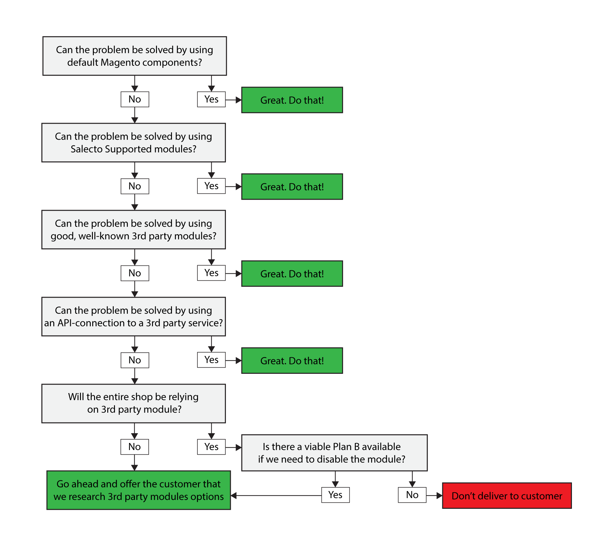

# 3rd Party Modules

## Initial considerations

First and foremost, a Salecto webshop should not be dependent on a specific 3rd party module. If the specific module somehow fails, it is out of our control to fix the problem. If a shop is dependent on a failed module, there is a high risk of the shop becoming useless. 

Secondly, it is always necessary to consider other options before finding possible 3rd party modules, with the purpose of evaluating if a 3rd party module is the only possible solution. 

Only after these considerations have been made, can we send an offer to the customer that we begin researching possible 3rd party modules that fits the customers needs. 

Remember, that it is better to find multiple options and let the customer choose, after having gotten the pros and cons for each module. The customer should always accept the specific 3rd party module and not just a solution. 

## Technical requirements

Before a module can begin to be used on a Salecto customers webshop, a technical assessment needs to be done. This should be done properly in order to prevent that modules are sold where we cannot accept them on our platform. 

Only if the following requirements are met, can we begin to evaluate whether or not installing a 3rd party module should be considered. 

### Semantic Versioning


See the official documentation here: [https://semver.org](https://semver.org)


Semantic Versioning is a naming scheme for software releases. E.g. version "4.3.5". 

The idea is to be able to characterize the backwards compatibility of a module update and to determine if it contains bug fixes or functionality. 

The scheme is structured with three integer numbers with these names: MAJOR.MINOR.PATCH  
From the example "4.3.5", "4" means that for this module there has been a total of four MAJOR releases.   
"3" means that for the fourth MAJOR release there has been three MINOR releases.   
"5" means that for the third MINOR release there has been five PATCH releases. 

#### Definitions

1. MAJOR versions is for when a new release, containing _new functionality_, **will NOT** guarantee compatibility with other software-systems relying on this package.
2. MINOR versions is for when a new release, containing _new functionality_, **will** guarantee compatibility with other software-systems relying on this package.
3.  PATCH versions is for when a new release, containing _only bug fixes_, **will** guarantee compatibility with other software-systems relying on this package.

We will only install 3rd party modules if they use Semantic Versioning.   
We are less worried about whether the developer uses Semantic Versioning correctly, but we prefer 3rd party developers using Semantic Versioning correctly. 

### Composer repository

Composer is a software management library that effectively is able to separate one software package, containing multiple versions, into multiple packages. It is also the way to for us to know that a new version of a module has been released from the developer. 

1. We only install 3rd party modules that are contained by a Composer repository.
2. We only install 3rd party modules that where the primary release channel is a Composer repository.

To be able to check if a 3rd party modules is Composer-compliant there is a couple of ways to check. 

1. Search on [Packagist.org](https://packagist.org/) \(The main repository for Composer\).
2. If the module is available on GitHub, there should be a file called "composer.json".
3. On the module developers home page, they could write something like "Composer Packs", which means it is compliant. 

## We can always reject a module

According to our terms, we can, for whatever reason we seem fit, deny to install a module. 

This was included so we can never be forced to install some 3rd partys work, that we know will cause problems. 

